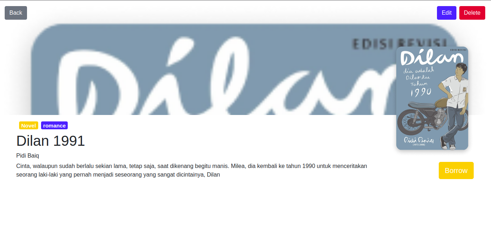
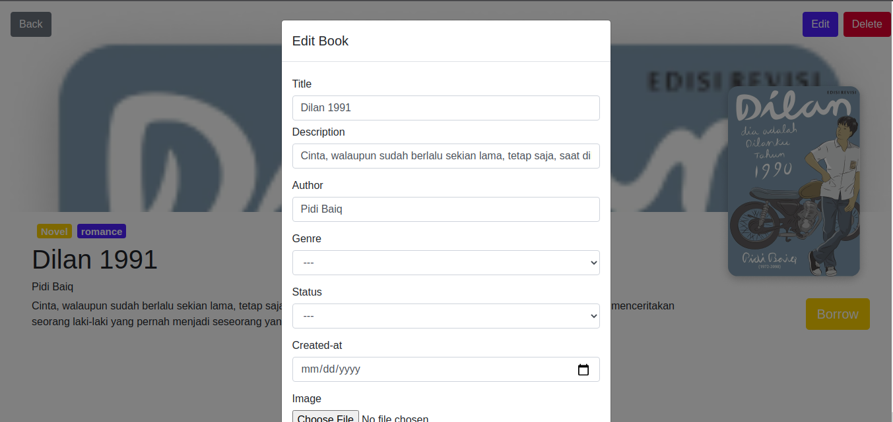

<h1 align="center">Website Library</h1>

  

 

  Built with React.js.

## Table of Contents

- [Introduction](#introduction)
- [Features](#features)
- [Requirements](#requirements)
- [Usage](#usage-for-development)
- [Screenshots](#screenshots)

## Introduction
Library is a website for borrowing books, where only members in this library can borrow books, and if a guest wants to borrow, the guest must log in first.

## Features
* List Book
* List borrow
* Detail book
* and others

## Requirements
* [`npm`](https://www.npmjs.com/get-npm)
* [`node.js`](https://nodejs.org/en/)

## Usage For Development
1. Open your terminal
2. Copy and Paste here `git clone https://github.com/RinaLia/library-reactjs.git`
3. cd `Website-Library-Manager` type `npm install` for install dependencies
4. type `npm start` fork run aplikasi. ***Make sure your device is connected with debugging mode***.

## Screenshots

     
     

